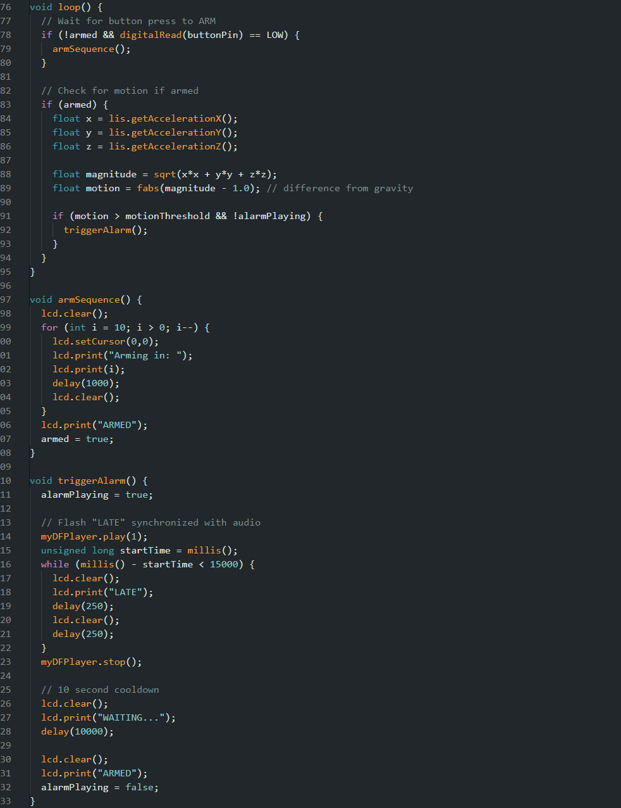
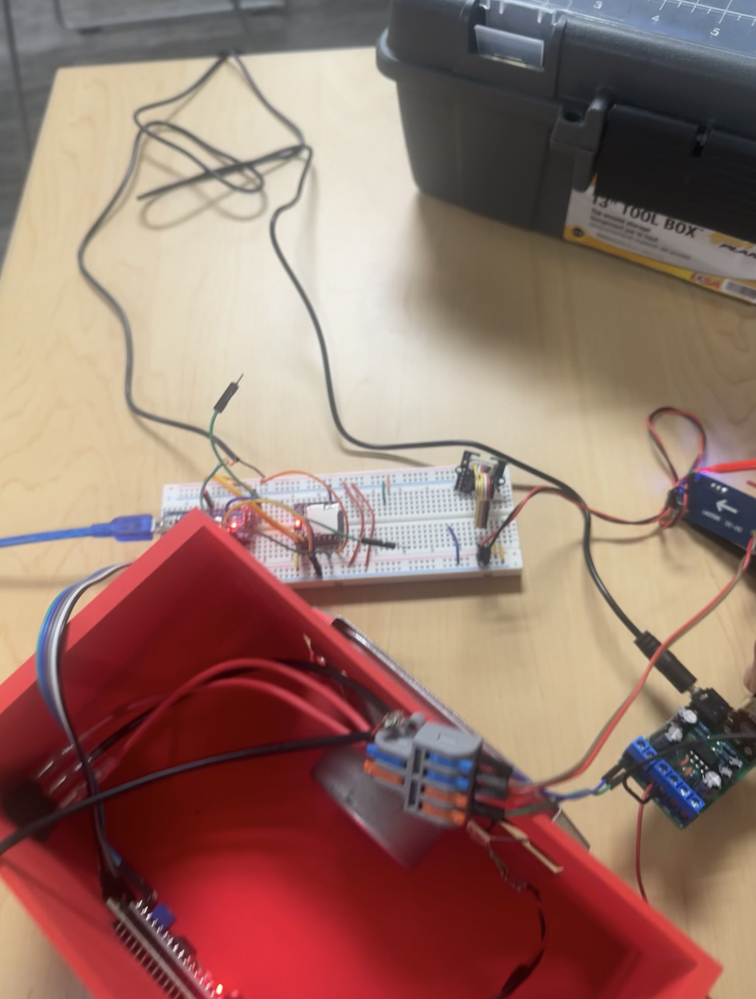
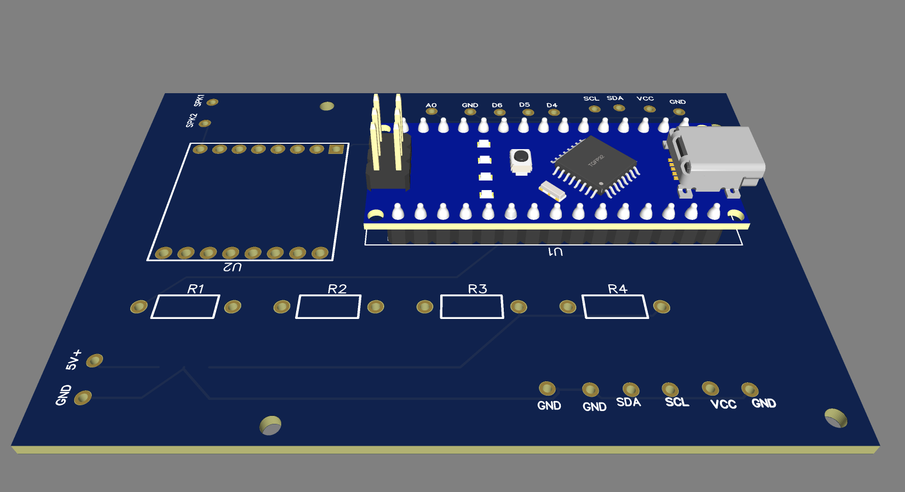
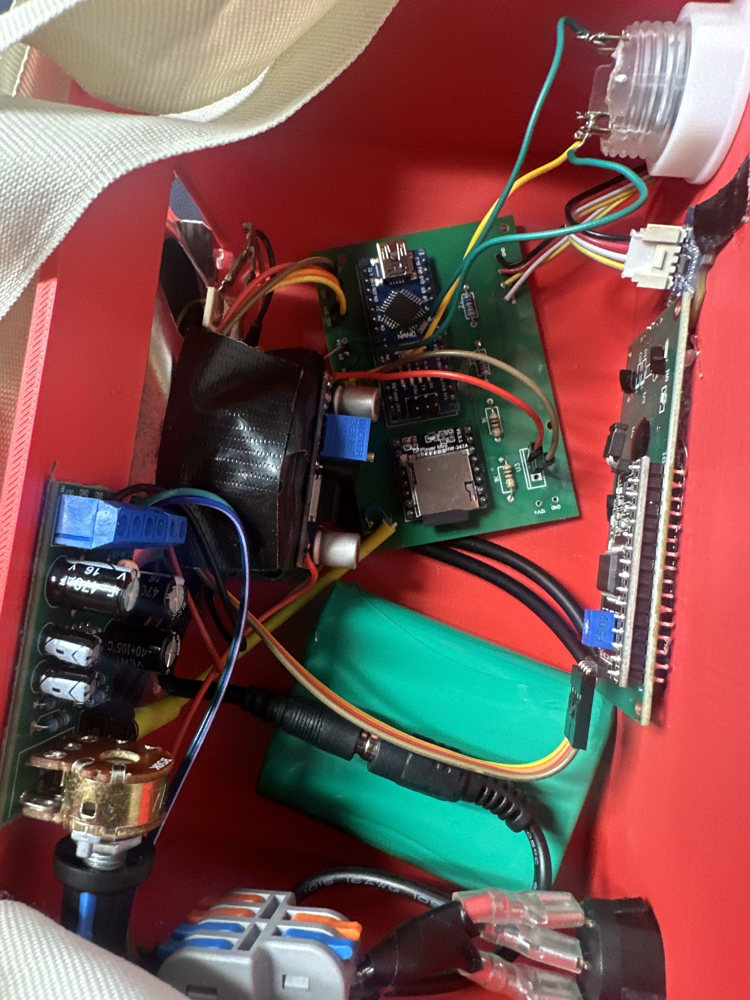

<h1>Motion-Sensing-Door-Alarm</h1>

 ### [YouTube Demonstration](https://youtube.com/shorts/Vd2loeKt7lI?feature=share)

<h2>Description</h2>
Created a motion-sensing door alarm using components from the school makerspace and a custom PCB. The system detected motion and played audio files stored on an SD card when triggered. The project was developed for an introductory engineering course and was well received by the professor, who kept the device to demonstrate to future classes.  
 

<h2>Languages and Utilities Used</h2>

- <b>EasyEDA</b>

- <b>Arduino</b>
  
- <b>Tinkercad</b>

<h2>Design and Build Process:</h2>

Code:  

 
 

Breadboard Prototype:
 
 

The device used a speaker, MP3 player module, audio amplifier, and LCD screen to play alarm audio and display system status information. A battery pack and buck converter powered the system, while onboard buttons allowed the user to arm and control the device.
 
 

EasyEDA PCB:
 
 

 
 

completed project:
 
 

 
 
